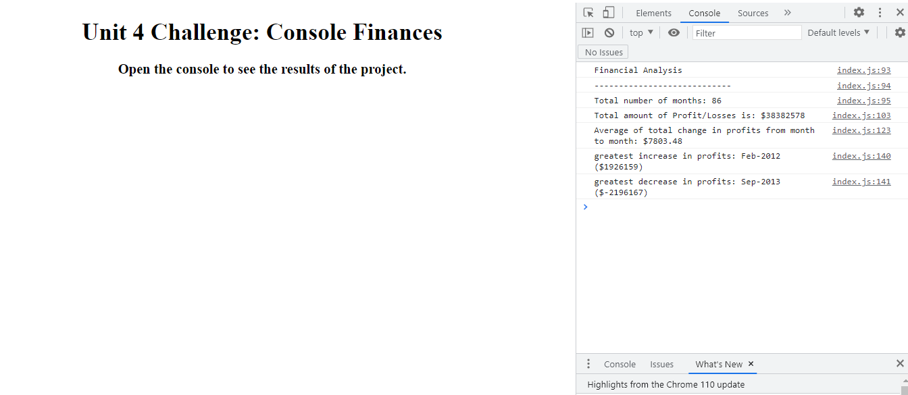

# Console-Finances
Code for analyzing the financial records of a company.

## Description

In this project I am creating code for analyzing the financial records of a company. I am using mostly JavaScript.Using the dataset provided I am calculating and displaying to the console the following:
    - The total number of months included in the dataset.
    - The net total amount of Profit/Losses over the entire period.
    - The average of the changes in Profit/Losses over the entire period.
    - The greatest increase in profits (date and amount) over the entire period.
    - The greatest decrease in losses (date and amount) over the entire period.

## Usage

Open the console and you will see the information mentioned before displayed there.

## License

MIT License.

